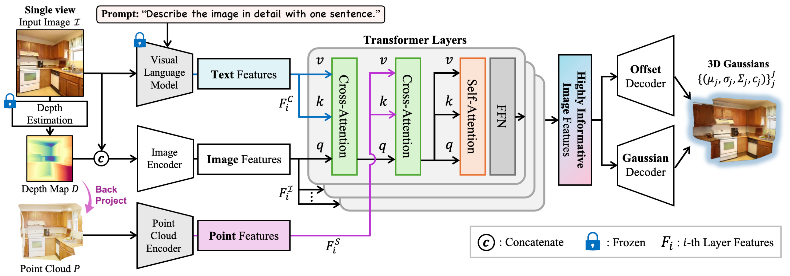

# CATSplat: Context-Aware Transformer with Spatial Guidance for Generalizable 3D Gaussian Splatting from A Single-View Image (ICCV 2025)

Official PyTorch implementation of the ICCV 2025 paper **CATSplat: Context-Aware Transformer with Spatial Guidance for Generalizable 3D Gaussian Splatting from A Single-View Image**

[\[Paper\]](https://arxiv.org/pdf/2412.12906), [\[Project Page\]](https://kuai-lab.github.io/catsplat2025/)

Wonseok Roh*, Hwanhee Jung*, Jong Wook Kim, Seunggwan Lee, Innfarn Yoo, Andreas Lugmayr, Seunggeun Chi, Karthik Ramani, Sangpil Kim

<div align="left">
  
  
  
</div>

<br>

<div align="center">
  
</div>

<br>

# Get Started

## 🛠 Environment

1. Create anaconda environment
```
conda create -y python=3.10 -n catsplat
conda activate catsplat
```

2. Install dependencies
```
pip install -r requirements-torch.txt --extra-index-url https://download.pytorch.org/whl/cu118
pip install -r requirements.txt
```

## 📦 Datasets Preparation

### RealEstate10K
We generally follow the dataset preparation process described in the [Flash3D](https://github.com/eldar/flash3d) repository.

> For downloading the RealEstate10K dataset we base our instructions on the Behind The Scenes scripts. First you need to download the video sequence metadata including camera poses from https://google.github.io/realestate10k/download.html and unpack it into data/ such that the folder layout is as follows:
>
> ```
> data/RealEstate10K/train
> data/RealEstate10K/test
> ```
>
> Finally download the training and test sets of the dataset with the following commands:
>
> ```
> python datasets/download_realestate10k.py -d data/RealEstate10K -o data/RealEstate10K -m train
> python datasets/download_realestate10k.py -d data/RealEstate10K -o data/RealEstate10K -m test
> ```
>
>This step will take several days to complete. Finally, download additional data for the RealEstate10K dataset. In particular, we provide pre-processed COLMAP cache containing sparse point clouds which are used to estimate the scaling factor for depth predictions. The last two commands filter the training and testing set from any missing video sequences.
>
> ```
> sh datasets/dowload_realestate10k_colmap.sh
> python -m datasets.preprocess_realestate10k -d data/RealEstate10K -s train
> python -m datasets.preprocess_realestate10k -d data/RealEstate10K -s test
> ```

We also utilize the LLaVA-1.5-13B model to obtain VLM text embeddings. <br>
By using the publicly available LLaVA model from the [Transformers](https://github.com/huggingface/transformers/tree/main) repository, you can modify the [`transformers/src/transformers/generation/utils.py`](https://github.com/huggingface/transformers/blob/main/src/transformers/generation/utils.py#L3498) file to extract `decoder_hidden_states`. 
<br>We precompute the LLaVA embeddings for all test datasets and use them during evaluation.


## 🎾 Training

To train on the RealEstate10K dataset, simply run the following command:

```
python train.py \
  +experiment=layered_re10k \
  model.depth.version=v1 \
  train.logging=false
```

Or you can simply run `train_single.sh`
```
bash train_single.sh
```

## ⛳ Evaluation

To evaluate on the RealEstate10K dataset, you can either run the `evaluate.sh` script or execute the following command:

```
python evaluate.py \
    hydra.run.dir=[PATH_TO_EXPERIMENT_DIRECTORY] \
    hydra.job.chdir=true \
    +experiment=layered_re10k \
    +dataset.crop_border=true \
    dataset.test_split_path=./splits/re10k_mine_filtered/test_files.txt \
    model.depth.version=v1 \
    ++eval.save_vis=false \
    run.checkpoint=[PATH_TO_CHECKPOINT]
```

You can find CATSplat (Re10K) checkpoint [here](https://kuaicv.synology.me/iccv2025/CATSplat).

# Citation
If you find this project useful, please consider citing:

```
@article{roh2024catsplat,
  title={CATSplat: Context-Aware Transformer with Spatial Guidance for Generalizable 3D Gaussian Splatting from A Single-View Image},
  author={Roh, Wonseok and Jung, Hwanhee and Kim, Jong Wook and Lee, Seunggwan and Yoo, Innfarn and Lugmayr, Andreas and Chi, Seunggeun and Ramani, Karthik and Kim, Sangpil},
  journal={arXiv preprint arXiv:2412.12906},
  year={2024}
}
```
